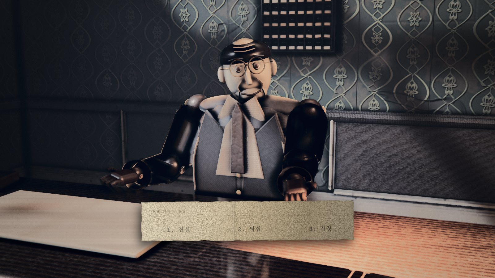
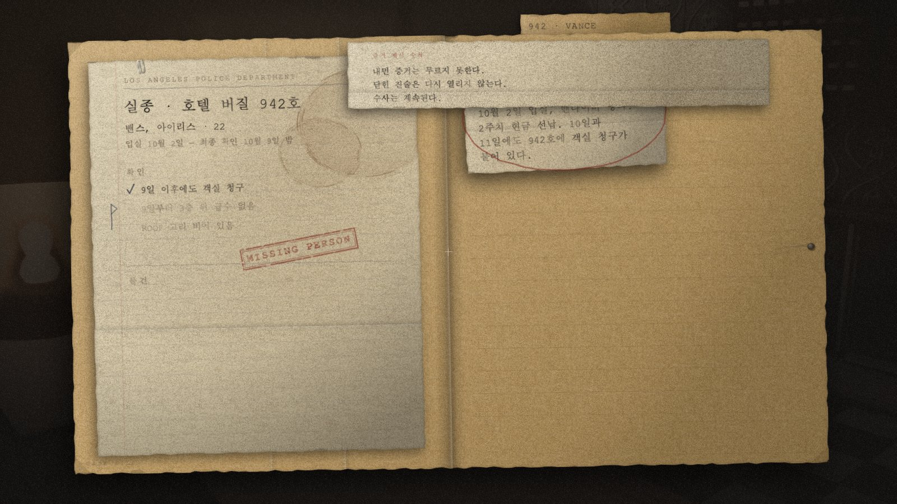

# HOTEL VIRGIL — 1947

**NAN 2026 사전 과제 제출물 3 · 게임 소개 및 설명**

플레이: <https://bluetop1102.github.io/virgil-1947/>
플레이 영상: {{YOUTUBE_URL}}
소스 코드: <https://github.com/bluetop1102/virgil-1947>

> **1947년 로스앤젤레스의 호텔을 조사하고 증언을 판단하는 1인칭 추리 공포 게임.
> 잘못 제시한 증거는 그 진술을 이번 회차에서 영구히 닫는다.**


| 항목 | 내용 |
|---|---|
| 장르 | 1인칭 추리 공포 · 필름 누아르 |
| 플랫폼 | 웹 브라우저 · 설치/계정/API 키 불필요 |
| 제출 범위 | 로비와 프런트를 다루는 **1막 수직 슬라이스** |
| 플레이 종료 | 프런트 심문 완료 뒤 격자문에서 **E**를 누르는 지점 · 별도 종료 화면 없음 |

<!-- pagebreak -->

## 1. 무엇을 하는 게임인가

플레이어는 LAPD 형사가 되어 호텔 버질에서 9일째 돌아오지 않는 투숙객 **아이리스 밴스**의
행방을 추적한다. 로비를 수색해 단서를 확보하고, 야간 프런트 **마를로 다이치**의 진술을
판단해 그가 숨긴 정보를 끌어내는 것이 이번 제출본의 목표다.

### 코어 루프

**로비 조사 → 진술 청취 → 진실·의심·거짓 판단 → 거짓이면 증거 직접 제시 → 반응과 다음 정보 확인**

- **진실**: 진술을 받아들인다.
- **의심**: 근거를 더 요구하고 다시 판단한다.
- **거짓**: 수사노트를 열어 보유한 증거 하나를 직접 고른다.
- **오답**: 해당 진술이 이번 회차에서 닫히며, 그 진술이 열어 줄 정보도 얻을 수 없다. 정답표나
  남은 기회 수는 표시되지 않으며 수사는 그대로 계속된다.



### 마리오네트 누아르

인물은 사실적 인간 대신 도자기 얼굴과 볼 관절을 가진 나무 마리오네트로 표현했다. 고정된 얼굴을
대신해 시선, 손, 어깨, 자세 변화가 불안과 거짓의 단서가 된다. 선택지와 수사노트도 HUD 패널이
아니라 찢은 종이와 LAPD 서류철로 보여 1947년의 물성을 유지한다.

### 제출본의 범위

이번 빌드에서 플레이할 수 있는 범위는 **1막 로비·프런트**다. 로비 단서 조사, 다이치의 진술
5건, 엘리베이터 상호작용까지 하나의 완주 경로로 구현돼 있다. 2·3막은 이번 제출본에서
플레이할 수 없다.

<!-- pagebreak -->

## 2. 게임 방법

### 목표

로비에서 다이치의 말을 검증할 단서를 확보하고, 그의 진술 5건을 모두 판단한다.

### 기본 조작

| 입력 | 동작 |
|---|---|
| 마우스 클릭 / 이동 | 포인터 잠금 · 시선 이동 |
| **W A S D** | 이동 |
| **Shift** | 누른 채 이동하면 달리기 |
| **E** | 조사 · 수집 · 심문 시작 · 엘리베이터/라디오 상호작용 |
| **Tab** | 수사노트 열기/닫기 |
| **Esc** | 열린 화면 닫기 · 일시정지/설정 |

인트로가 끝나면 `이동 W A S D · 달리기 Shift · 조사 E · 수첩 Tab · 카드 Esc`가 적힌 손글씨
카드가 나타난다.
놓쳤다면 **Esc → 설정**에서 같은 조작을 다시 확인할 수 있다.

### 심문 조작

| 입력 | 동작 |
|---|---|
| **1 · 2 · 3** 또는 쪽지 클릭 | 진실 · 의심 · 거짓 선택 |
| 방향키 또는 증거 클릭 | 거짓 선택 후 증거 이동/선택 |
| **Enter** | 증거 제시 |
| **Esc** | 증거 선택 취소 |



### 플레이 흐름

1. 타이틀의 놋쇠 벨 또는 **「체크인」** 명패를 눌러 시작한다.
2. 30초 인트로 뒤 조작을 넘겨받아 로비를 조사한다.
3. 다이치에게 **E**로 말을 걸고 진술 5건을 판단한다. 거짓을 고르면 수사노트에서 증거를 제시한다.
4. 심문이 끝난 뒤 격자문 앞에서 **E**를 누르면 내부 상태가 2막으로 넘어간다. 현재 제출본은 문·공간·
   종료 화면을 바꾸지 않고 게이트음만 재생한다. **그 입력까지가 이번 제출 범위**다.

진행은 저장되지 않는다. 새로고침하거나 탭을 닫으면 처음부터 시작하므로 한 회차에서 완료해 주세요.

<!-- pagebreak -->

## 3. 실행 방법

### 심사용 권장 경로

1. <https://bluetop1102.github.io/virgil-1947/> 를 연다.
2. 로딩과 허구 고지 뒤 타이틀이 나타나면 화면을 한 번 눌러 입장하고, 놋쇠 벨 또는
   **「체크인」** 명패를 눌러 새 게임을 시작한다.
3. 클릭하면 마우스가 잠기고 **Esc**를 누르면 풀린다. 이후 조작은 §2와 같다.

설치, 로그인, 유료 라이선스, API 키가 필요 없다. 최신 Chromium 계열 브라우저와 WebGL2를
권장하며, 공간 음향과 심문 긴장층을 들을 수 있도록 **헤드폰 사용을 권장**한다. 성능이 부족하면
**Esc → 설정 → 품질**에서 `medium` 또는 `low`를 선택한다.

### 소스에서 실행

```bash
git clone https://github.com/bluetop1102/virgil-1947
cd virgil-1947
npm install
npm run dev
```

로컬 주소는 `http://127.0.0.1:5173`이며, GitHub Pages용 정적 빌드는 `npm run build:pages`다.

## 4. 제출 링크

| 대상 | URL |
|---|---|
| 플레이 | <https://bluetop1102.github.io/virgil-1947/> |
| 플레이 영상 | {{YOUTUBE_URL}} |
| 전체 소스·커밋 이력 | <https://github.com/bluetop1102/virgil-1947> |

세 링크는 심사 종료까지 접근 가능한 상태로 유지한다.

## 5. 고지

이 이야기의 인물·사건·호텔은 모두 허구이며 실존 인물·사건·업체와 무관하다. 타이틀 배경은
AI 생성 이미지이고 인게임 월드에는 사용하지 않았다. 로비 라디오 3곡과 긴장층 2곡은 Kevin
MacLeod의 CC BY 4.0 음원이다. 긴장층 중 한 곡은 1막 심문에, 한 곡은 제출 슬라이스 밖 3막
지목판에 배선돼 있다. 상세 출처는 **제출물 4 · AI 활용 기술**에 기재했다.
